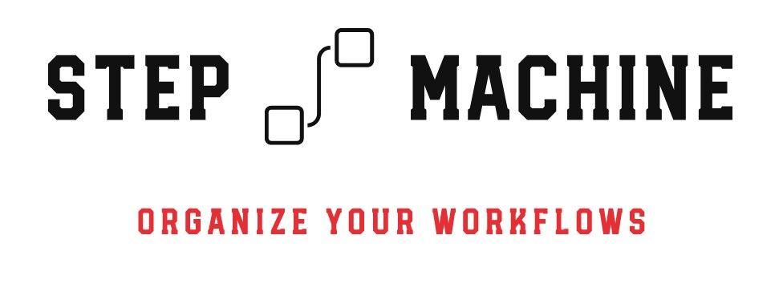

# step-machine

A library and related toolset to build execution workflows of asynchronous/long-running steps.

## Packages docs
* [step-machine](/packages/step-machine/README.md)
* [step-machine-graphviz]

## Usage

check unit tests.

## Future Plans
* add StepMachine.start() to start with the registered entry point of the step machine.
* add checks for stem-machine consistency
  * all exit/entry points connected

